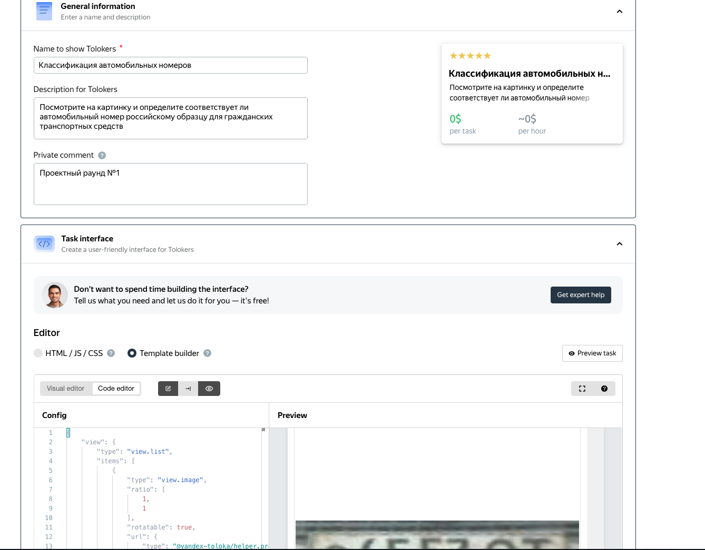
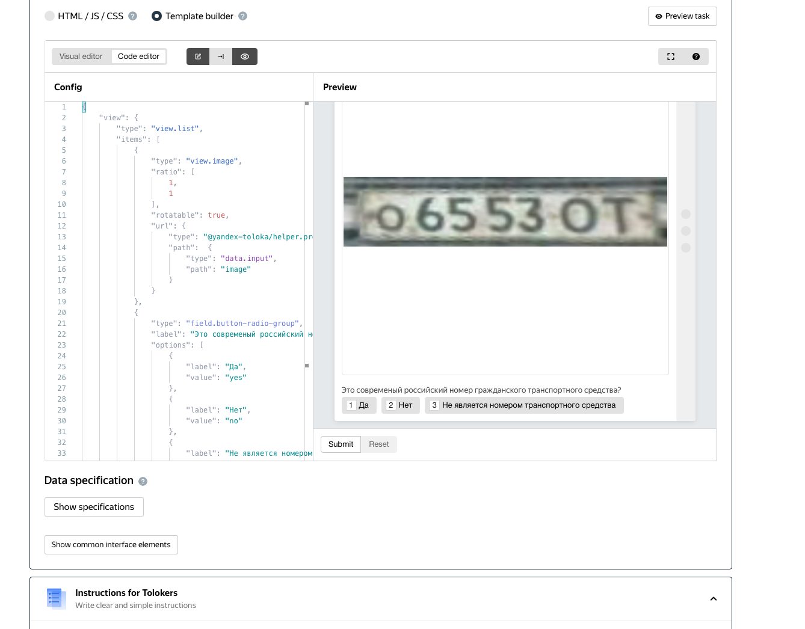
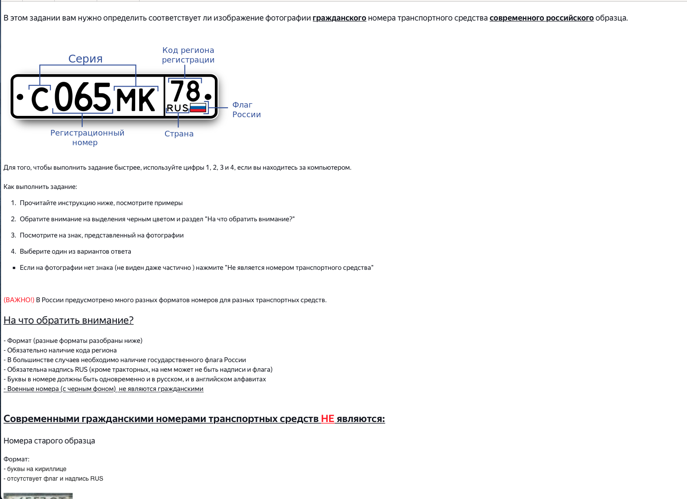

# CrowdsourcingSegmentationProject
The task is to train a classifier that distinguishes Russian–style license plates from all others.

Used 30$ we marked up majority object in train dataset and after train model 

Classification of car license plates (identify the country): 
1. Using crowdsourcing tool – toloka.ai labeled dataset 
2. Solve Supervised CV (Segmentation + Classification) task using base pytroch-lighnintg model

Current task description (in Russian): https://github.com/pilot7747/shad_cv_project_22

## Toloka project settings
Project settings:

|   |   |   |
|---|---|---|

Pool settings:
 

## Model developing
labeled dataset(after DawidSkene aggregation algorithm):
 - aggregated_results_by_ds__pool_35739415__2022_10_05
 - aggregated_results_by_ds__pool_35803045__2022_10_09

base model – `mobilenetv2_100`

